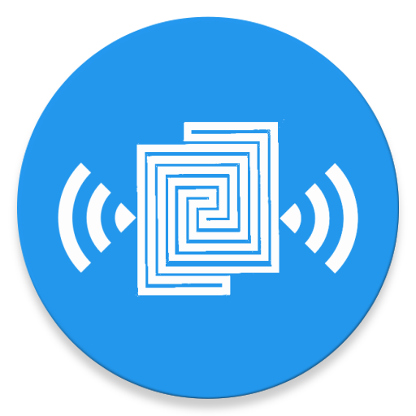

# Eye Track

<p align="center"></p>

<p align="center"> 
**Android Satellite Tracking App**
<br><br>
*Live Real Time Satellite Tracking and Predictions*
<br><br>
</center>

Main Purpose: **Monitoring Satellite Platforms From Earth**

Main Features:

  * Select any satellite orbiting the Earth and check where is located now

  * Check satellite passes over your location and receive alerts on your android device

## Documentation

If you want to learn more, you can check [EyeTrack's docs page.](link)

## Demo
*Screenshot*

*Video*
<a href="http://www.youtube.com/watch?feature=player_embedded&v=OidF-rlLXMo" target="_blank"></a>

## License

Eye Track is licensed under GNU General Public License v3.0
```
"Eye Track" is an Android Satellite Tracking App for Live Real Time Satellite Tracking and Predictions.
Copyright (C) 2016  Manuel Martín-González

This program is free software: you can redistribute it and/or modify
it under the terms of the GNU General Public License as published by
the Free Software Foundation, either version 3 of the License, or
(at your option) any later version.

This program is distributed in the hope that it will be useful,
but WITHOUT ANY WARRANTY; without even the implied warranty of
MERCHANTABILITY or FITNESS FOR A PARTICULAR PURPOSE.  See the
GNU General Public License for more details.

You should have received a copy of the GNU General Public License
along with this program.  If not, see <http://www.gnu.org/licenses/>.
```
